# Sơ đồ logic OptiImg

Sơ đồ Mermaid cho toàn bộ logic giai đoạn 1 (Core + CLI).
Xem được trên GitHub, VS Code (extension “Markdown Preview Mermaid Support”) hoặc https://mermaid.live.

Tài liệu gốc: [compression-logic.md](compression-logic.md), [cli-flow.md](cli-flow.md),
plan: [superpowers/plans/2026-11-14-optiimg-core-cli.md](superpowers/plans/2026-11-14-optiimg-core-cli.md).

## Mục lục

1. [Tổng quan hệ thống](#1-tổng-quan-hệ-thống)
2. [Luồng CLI tổng](#2-luồng-cli-tổng)
3. [Quét thư mục](#3-quét-thư-mục)
4. [Xác nhận](#4-xác-nhận)
5. [Worker pool và token bộ nhớ](#5-worker-pool-và-token-bộ-nhớ)
6. [Job xử lý một file](#6-job-xử-lý-một-file)
7. [Ghi đè nguyên tử](#7-ghi-đè-nguyên-tử)
8. [Đánh dấu đã nén (xattr)](#8-đánh-dấu-đã-nén-xattr)
9. [Ctrl+C](#9-ctrlc)
10. [core.Compress](#10-corecompress)
11. [Nhận diện, giới hạn, giải mã](#11-nhận-diện-giới-hạn-giải-mã)
12. [Xoay theo EXIF](#12-xoay-theo-exif)
13. [Nhánh PNG: tổng](#13-nhánh-png-tổng)
14. [Histogram](#14-histogram)
15. [Median cut](#15-median-cut)
16. [K-means](#16-k-means)
17. [Tìm số màu N](#17-tìm-số-màu-n)
18. [Remap + Floyd–Steinberg](#18-remap--floydsteinberg)
19. [Sắp palette và ghi PNG](#19-sắp-palette-và-ghi-png)
20. [Nhánh JPEG](#20-nhánh-jpeg)
21. [Ước lượng chất lượng JPEG gốc](#21-ước-lượng-chất-lượng-jpeg-gốc)
22. [SSIM](#22-ssim)
23. [Cấu trúc dữ liệu](#23-cấu-trúc-dữ-liệu)
24. [Lỗi và mã thoát](#24-lỗi-và-mã-thoát)

---

## 1. Tổng quan hệ thống

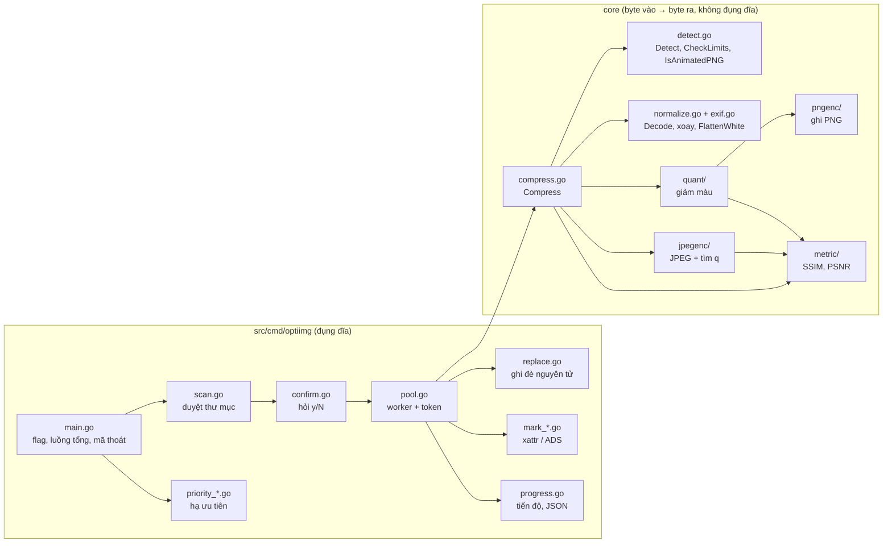
```mermaid
flowchart LR
    subgraph CLI["src/cmd/optiimg (đụng đĩa)"]
        main["main.go<br/>flag, luồng tổng, mã thoát"]
        confirm["confirm.go<br/>hỏi y/N"]
        scan["scan.go<br/>duyệt thư mục"]
        pool["pool.go<br/>worker + token"]
        replace["replace.go<br/>ghi đè nguyên tử"]
        mark["mark_*.go<br/>xattr / ADS"]
        prio["priority_*.go<br/>hạ ưu tiên"]
        progress["progress.go<br/>tiến độ, JSON"]
    end

    subgraph CORE["core (byte vào → byte ra, không đụng đĩa)"]
        compress["compress.go<br/>Compress"]
        detect["detect.go<br/>Detect, CheckLimits, IsAnimatedPNG"]
        normalize["normalize.go + exif.go<br/>Decode, xoay, FlattenWhite"]
        quant["quant/<br/>giảm màu"]
        pngenc["pngenc/<br/>ghi PNG"]
        jpegenc["jpegenc/<br/>JPEG + tìm q"]
        metric["metric/<br/>SSIM, PSNR"]
    end

    main --> scan --> confirm --> pool
    main --> prio
    pool --> compress
    pool --> replace
    pool --> mark
    pool --> progress
    compress --> detect
    compress --> normalize
    compress --> quant --> pngenc
    compress --> jpegenc
    quant --> metric
    jpegenc --> metric
    compress --> metric
```

Ranh giới: `core` không biết tới file, thư mục, xattr; mọi I/O thuộc về CLI.

---

## 2. Luồng CLI tổng

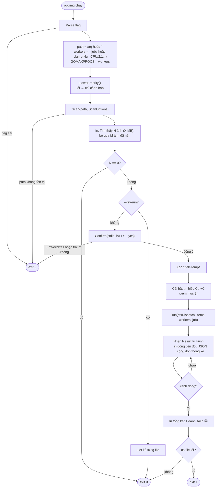
```mermaid
flowchart TD
    A([optiimg chạy]) --> B["Parse flag"]
    B -->|flag sai| X2([exit 2])
    B --> C["path = arg hoặc '.'<br/>workers = --jobs hoặc clamp(NumCPU/2,1,4)<br/>GOMAXPROCS = workers"]
    C --> D["LowerPriority()<br/>lỗi → chỉ cảnh báo"]
    D --> E["Scan(path, ScanOptions)"]
    E -->|path không tồn tại| X2
    E --> F["In: Tìm thấy N ảnh (X MB),<br/>bỏ qua M ảnh đã nén"]
    F --> G{N == 0?}
    G -->|có| X0([exit 0])
    G -->|không| H{--dry-run?}
    H -->|có| H1["Liệt kê từng file"] --> X0
    H -->|không| I["Confirm(stdin, isTTY, --yes)"]
    I -->|ErrNeedYes hoặc trả lời không| X2
    I -->|đồng ý| J["Xóa StaleTemps"]
    J --> K["Cài bắt tín hiệu Ctrl+C<br/>(xem mục 9)"]
    K --> L["Run(ctxDispatch, items, workers, job)"]
    L --> M["Nhận Result từ kênh<br/>→ in dòng tiến độ / JSON<br/>→ cộng dồn thống kê"]
    M --> N{kênh đóng?}
    N -->|chưa| M
    N -->|rồi| O["In tổng kết + danh sách lỗi"]
    O --> P{có file lỗi?}
    P -->|có| X1([exit 1])
    P -->|không| X0
```

---

## 3. Quét thư mục

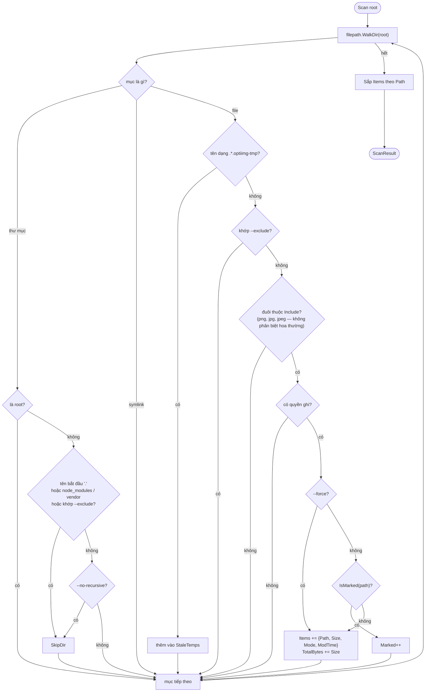
```mermaid
flowchart TD
    S([Scan root]) --> W["filepath.WalkDir(root)"]
    W --> E{mục là gì?}

    E -->|thư mục| D1{"là root?"}
    D1 -->|có| NEXT
    D1 -->|không| D2{"tên bắt đầu '.'<br/>hoặc node_modules / vendor<br/>hoặc khớp --exclude?"}
    D2 -->|có| SKIPDIR["SkipDir"] --> NEXT
    D2 -->|không| D3{--no-recursive?}
    D3 -->|có| SKIPDIR
    D3 -->|không| NEXT

    E -->|symlink| NEXT
    E -->|file| F1{"tên dạng .*.optiimg-tmp?"}
    F1 -->|có| TMP["thêm vào StaleTemps"] --> NEXT
    F1 -->|không| F2{"khớp --exclude?"}
    F2 -->|có| NEXT
    F2 -->|không| F3{"đuôi thuộc Include?<br/>(png, jpg, jpeg — không phân biệt hoa thường)"}
    F3 -->|không| NEXT
    F3 -->|có| F4{"có quyền ghi?"}
    F4 -->|không| NEXT
    F4 -->|có| F5{"--force?"}
    F5 -->|có| ADD
    F5 -->|không| F6{"IsMarked(path)?"}
    F6 -->|có| MK["Marked++"] --> NEXT
    F6 -->|không| ADD["Items += {Path, Size, Mode, ModTime}<br/>TotalBytes += Size"] --> NEXT

    NEXT["mục tiếp theo"] --> W
    W -->|hết| SORT["Sắp Items theo Path"] --> R([ScanResult])
```

Ghi chú:
- `IsMarked` lúc quét phải đọc cả file để tính hash. Để quét nhanh: chỉ đọc xattr trước;
  không có xattr → chắc chắn chưa đánh dấu, khỏi đọc file.
- Định dạng thật xác nhận sau bằng magic bytes trong job (mục 6), không phải lúc quét.

---

## 4. Xác nhận

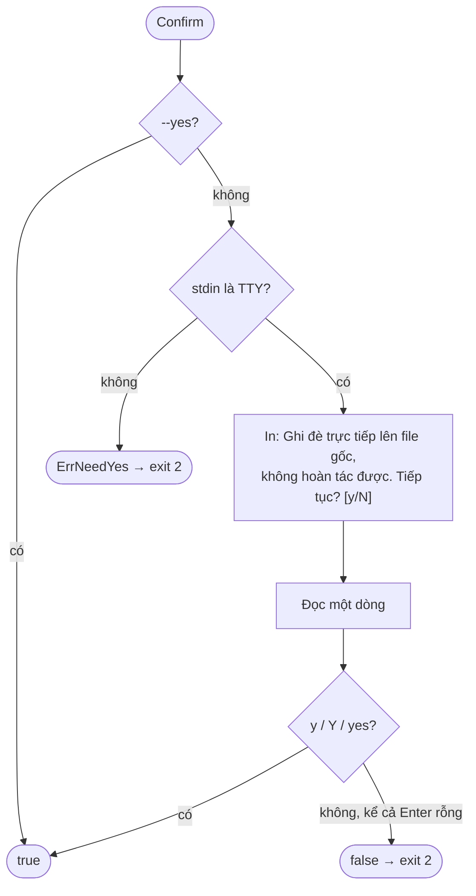
```mermaid
flowchart TD
    A([Confirm]) --> B{--yes?}
    B -->|có| T([true])
    B -->|không| C{stdin là TTY?}
    C -->|không| E([ErrNeedYes → exit 2])
    C -->|có| D["In: Ghi đè trực tiếp lên file gốc,<br/>không hoàn tác được. Tiếp tục? [y/N]"]
    D --> R["Đọc một dòng"]
    R --> F{"y / Y / yes?"}
    F -->|có| T
    F -->|không, kể cả Enter rỗng| N([false → exit 2])
```

---

## 5. Worker pool và ngân sách bộ nhớ

> Cập nhật 2026-11-14: thay token 1/2/all bằng ngân sách byte (pixel × 50 B, mặc định 2 GB). Sơ đồ dưới giữ nguyên ý tưởng: ảnh lớn chiếm hết, ảnh nhỏ chạy song song.

### 5.1 Cấu trúc

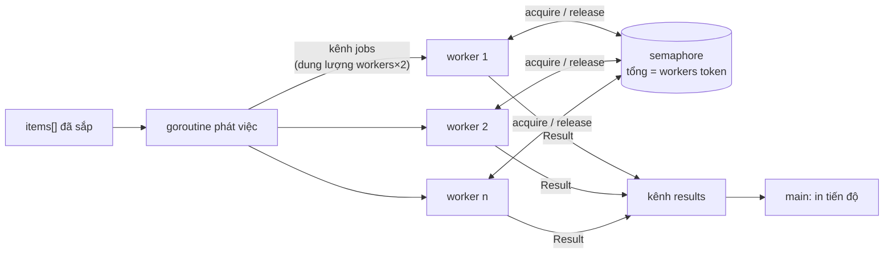
```mermaid
flowchart LR
    Items["items[] đã sắp"] --> Disp["goroutine phát việc"]
    Disp -->|"kênh jobs<br/>(dung lượng workers×2)"| W1["worker 1"]
    Disp --> W2["worker 2"]
    Disp --> Wn["worker n"]
    W1 & W2 & Wn <-->|"acquire / release"| Sem[("semaphore<br/>tổng = workers token")]
    W1 & W2 & Wn -->|Result| Res["kênh results"]
    Res --> Main["main: in tiến độ"]
```

### 5.2 Số token theo kích thước ảnh

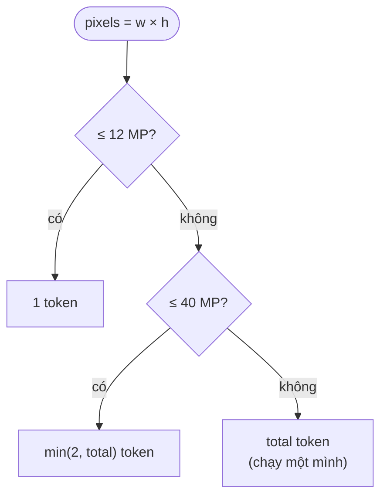
```mermaid
flowchart TD
    P([pixels = w × h]) --> A{"≤ 12 MP?"}
    A -->|có| T1["1 token"]
    A -->|không| B{"≤ 40 MP?"}
    B -->|có| T2["min(2, total) token"]
    B -->|không| T3["total token<br/>(chạy một mình)"]
```

### 5.3 Tuần tự thời gian (ví dụ workers = 4)

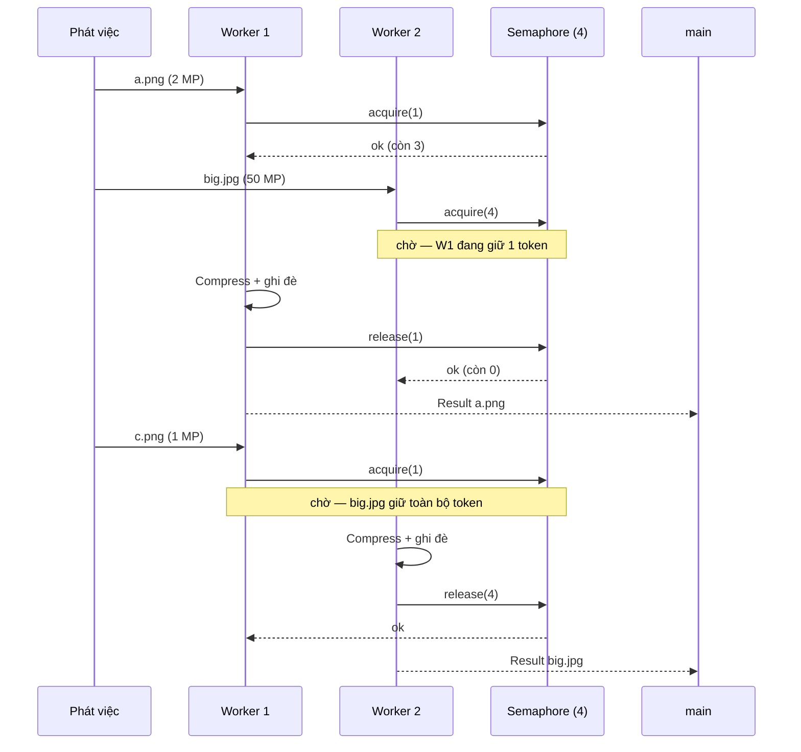
```mermaid
sequenceDiagram
    participant D as Phát việc
    participant W1 as Worker 1
    participant W2 as Worker 2
    participant S as Semaphore (4)
    participant M as main

    D->>W1: a.png (2 MP)
    W1->>S: acquire(1)
    S-->>W1: ok (còn 3)
    D->>W2: big.jpg (50 MP)
    W2->>S: acquire(4)
    Note over W2,S: chờ — W1 đang giữ 1 token
    W1->>W1: Compress + ghi đè
    W1->>S: release(1)
    S-->>W2: ok (còn 0)
    W1-->>M: Result a.png
    D->>W1: c.png (1 MP)
    W1->>S: acquire(1)
    Note over W1,S: chờ — big.jpg giữ toàn bộ token
    W2->>W2: Compress + ghi đè
    W2->>S: release(4)
    S-->>W1: ok
    W2-->>M: Result big.jpg
```

Lưu ý: semaphore cấp token **theo thứ tự yêu cầu** (FIFO) để ảnh lớn không bị ảnh nhỏ chen mãi.

---

## 6. Job xử lý một file

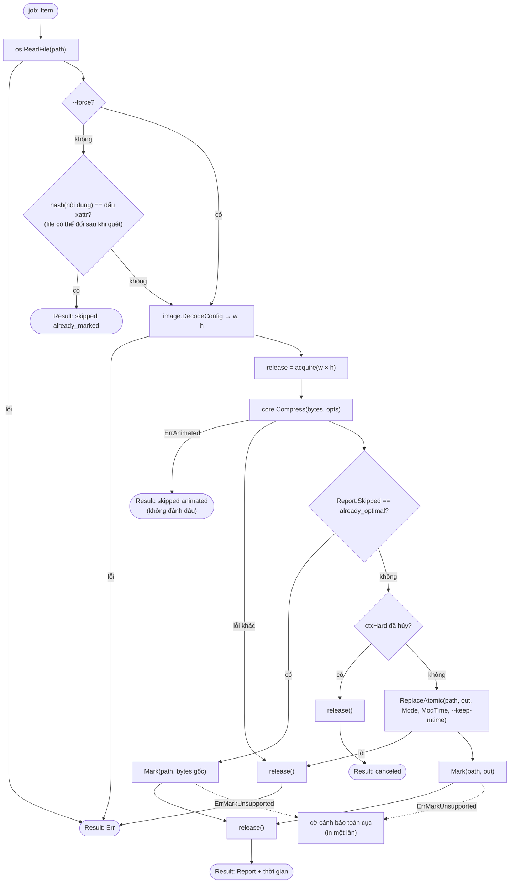
```mermaid
flowchart TD
    A([job: Item]) --> B["os.ReadFile(path)"]
    B -->|lỗi| ERR
    B --> C{"--force?"}
    C -->|không| C1{"hash(nội dung) == dấu xattr?<br/>(file có thể đổi sau khi quét)"}
    C1 -->|có| SKM(["Result: skipped already_marked"])
    C1 -->|không| D
    C -->|có| D["image.DecodeConfig → w, h"]
    D -->|lỗi| ERR
    D --> E["release = acquire(w × h)"]
    E --> F["core.Compress(bytes, opts)"]
    F -->|ErrAnimated| SKA(["Result: skipped animated<br/>(không đánh dấu)"])
    F -->|lỗi khác| REL1["release()"] --> ERR
    F --> G{"Report.Skipped == already_optimal?"}
    G -->|có| MK1["Mark(path, bytes gốc)"] --> REL2
    G -->|không| H{"ctxHard đã hủy?"}
    H -->|có| REL3["release()"] --> CAN(["Result: canceled"])
    H -->|không| I["ReplaceAtomic(path, out, Mode, ModTime, --keep-mtime)"]
    I -->|lỗi| REL1
    I --> MK2["Mark(path, out)"]
    MK2 --> REL2["release()"]
    REL2 --> OK(["Result: Report + thời gian"])
    MK1 -.->|ErrMarkUnsupported| WARN["cờ cảnh báo toàn cục<br/>(in một lần)"]
    MK2 -.->|ErrMarkUnsupported| WARN

    ERR(["Result: Err"])
```

---

## 7. Ghi đè nguyên tử

### 7.1 Luồng

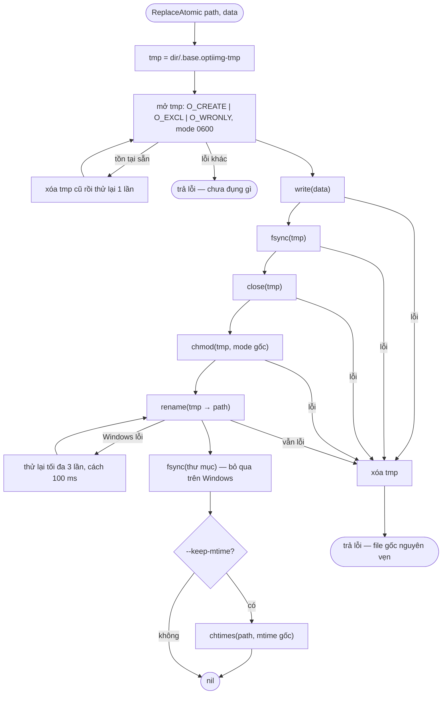
```mermaid
flowchart TD
    A([ReplaceAtomic path, data]) --> B["tmp = dir/.base.optiimg-tmp"]
    B --> C["mở tmp: O_CREATE | O_EXCL | O_WRONLY, mode 0600"]
    C -->|tồn tại sẵn| C1["xóa tmp cũ rồi thử lại 1 lần"] --> C
    C -->|lỗi khác| E1([trả lỗi — chưa đụng gì])
    C --> D["write(data)"]
    D --> F["fsync(tmp)"]
    F --> G["close(tmp)"]
    G --> H["chmod(tmp, mode gốc)"]
    H --> I["rename(tmp → path)"]
    I -->|Windows lỗi| I1["thử lại tối đa 3 lần, cách 100 ms"] --> I
    I --> J["fsync(thư mục) — bỏ qua trên Windows"]
    J --> K{--keep-mtime?}
    K -->|có| L["chtimes(path, mtime gốc)"] --> OK
    K -->|không| OK([nil])

    D -->|lỗi| CL
    F -->|lỗi| CL
    G -->|lỗi| CL
    H -->|lỗi| CL
    I -->|vẫn lỗi| CL["xóa tmp"] --> E2([trả lỗi — file gốc nguyên vẹn])
```

### 7.2 Trạng thái đĩa nếu bị dừng đột ngột

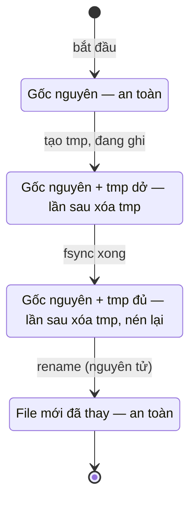
```mermaid
stateDiagram-v2
    [*] --> GocNguyen: bắt đầu
    GocNguyen --> GocVaTmpDo: tạo tmp, đang ghi
    GocVaTmpDo --> GocVaTmpDu: fsync xong
    GocVaTmpDu --> DaThay: rename (nguyên tử)
    DaThay --> [*]

    GocNguyen: Gốc nguyên — an toàn
    GocVaTmpDo: Gốc nguyên + tmp dở — lần sau xóa tmp
    GocVaTmpDu: Gốc nguyên + tmp đủ — lần sau xóa tmp, nén lại
    DaThay: File mới đã thay — an toàn
```

Không có thời điểm nào file gốc bị ghi dở.

---

## 8. Đánh dấu đã nén (xattr)

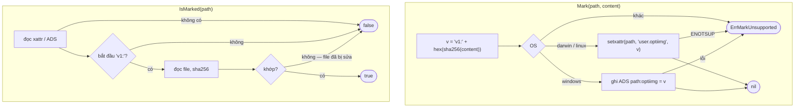
```mermaid
flowchart TD
    subgraph Ghi["Mark(path, content)"]
        M1["v = 'v1:' + hex(sha256(content))"] --> M2{OS}
        M2 -->|darwin / linux| M3["setxattr(path, 'user.optiimg', v)"]
        M2 -->|windows| M4["ghi ADS path:optiimg = v"]
        M2 -->|khác| MU([ErrMarkUnsupported])
        M3 -->|ENOTSUP| MU
        M4 -->|lỗi| MU
        M3 --> MOK([nil])
        M4 --> MOK
    end

    subgraph Doc["IsMarked(path)"]
        R1["đọc xattr / ADS"] -->|không có| RF([false])
        R1 --> R2{"bắt đầu 'v1:'?"}
        R2 -->|không| RF
        R2 -->|có| R3["đọc file, sha256"]
        R3 --> R4{khớp?}
        R4 -->|có| RT([true])
        R4 -->|không — file đã bị sửa| RF
    end
```

Vì sao dùng hash chứ không chỉ cờ: người dùng sửa ảnh sau khi nén → hash đổi → ảnh được nén lại.

---

## 9. Ctrl+C

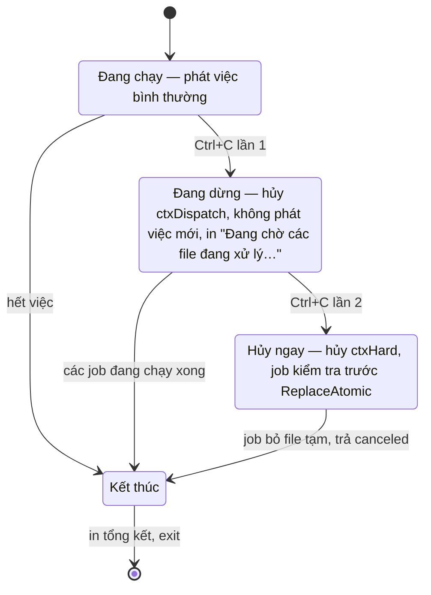
```mermaid
stateDiagram-v2
    [*] --> DangChay
    DangChay --> DangDung: Ctrl+C lần 1
    DangDung --> HuyNgay: Ctrl+C lần 2
    DangChay --> Xong: hết việc
    DangDung --> Xong: các job đang chạy xong
    HuyNgay --> Xong: job bỏ file tạm, trả canceled
    Xong --> [*]: in tổng kết, exit

    DangChay: Đang chạy — phát việc bình thường
    DangDung: Đang dừng — hủy ctxDispatch, không phát việc mới, in "Đang chờ các file đang xử lý…"
    HuyNgay: Hủy ngay — hủy ctxHard, job kiểm tra trước ReplaceAtomic
    Xong: Kết thúc
```

`core.Compress` không bị ngắt giữa chừng (chỉ tốn CPU, không đụng đĩa). Điểm kiểm tra duy nhất là **trước khi ghi đè**.

---

## 10. core.Compress

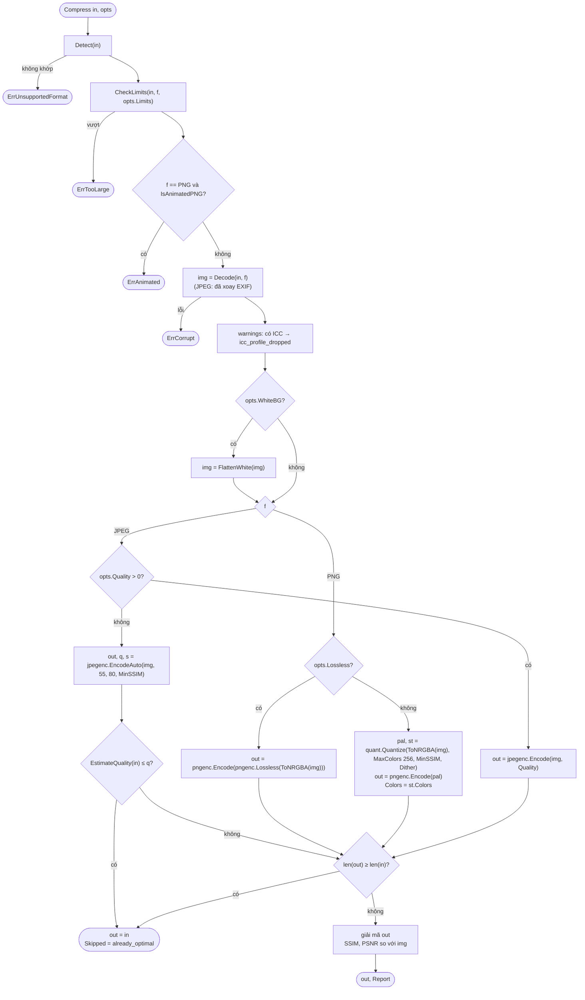
```mermaid
flowchart TD
    A([Compress in, opts]) --> B["Detect(in)"]
    B -->|không khớp| EU([ErrUnsupportedFormat])
    B --> C["CheckLimits(in, f, opts.Limits)"]
    C -->|vượt| ET([ErrTooLarge])
    C --> D{"f == PNG và IsAnimatedPNG?"}
    D -->|có| EA([ErrAnimated])
    D -->|không| E["img = Decode(in, f)<br/>(JPEG: đã xoay EXIF)"]
    E -->|lỗi| EC([ErrCorrupt])
    E --> W["warnings: có ICC → icc_profile_dropped"]
    W --> F{opts.WhiteBG?}
    F -->|có| F1["img = FlattenWhite(img)"] --> G
    F -->|không| G{f}

    G -->|PNG| P{opts.Lossless?}
    P -->|có| P1["out = pngenc.Encode(pngenc.Lossless(ToNRGBA(img)))"]
    P -->|không| P2["pal, st = quant.Quantize(ToNRGBA(img), MaxColors 256, MinSSIM, Dither)<br/>out = pngenc.Encode(pal)<br/>Colors = st.Colors"]

    G -->|JPEG| J{opts.Quality > 0?}
    J -->|có| J1["out = jpegenc.Encode(img, Quality)"]
    J -->|không| J2["out, q, s = jpegenc.EncodeAuto(img, 55, 80, MinSSIM)"]
    J2 --> J3{"EstimateQuality(in) ≤ q?"}
    J3 -->|có| KEEP
    J3 -->|không| Z

    P1 --> Z
    P2 --> Z
    J1 --> Z
    Z{"len(out) ≥ len(in)?"}
    Z -->|có| KEEP(["out = in<br/>Skipped = already_optimal"])
    Z -->|không| M["giải mã out<br/>SSIM, PSNR so với img"]
    M --> R(["out, Report"])
```

Lưu ý nhánh PNG: ảnh vào đã là palette ≤ 256 màu → `Quantize` đi nhánh lossless,
encoder chuẩn thường cho file bằng hoặc lớn hơn → chốt chặn giữ file gốc. Nén lại nhiều lần không làm ảnh xấu thêm.

---

## 11. Nhận diện, giới hạn, giải mã

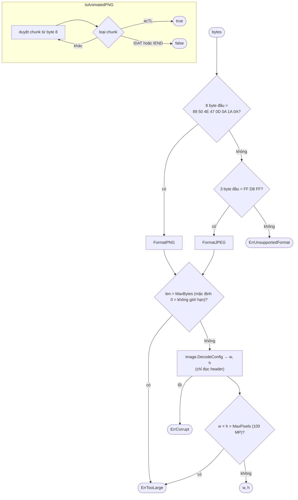
```mermaid
flowchart TD
    A([bytes]) --> B{"8 byte đầu =<br/>89 50 4E 47 0D 0A 1A 0A?"}
    B -->|có| PNG[FormatPNG]
    B -->|không| C{"3 byte đầu = FF D8 FF?"}
    C -->|có| JPG[FormatJPEG]
    C -->|không| U([ErrUnsupportedFormat])

    PNG & JPG --> L1{"len > MaxBytes (mặc định 0 = không giới hạn)?"}
    L1 -->|có| T([ErrTooLarge])
    L1 -->|không| L2["image.DecodeConfig → w, h<br/>(chỉ đọc header)"]
    L2 -->|lỗi| CR([ErrCorrupt])
    L2 --> L3{"w × h > MaxPixels (100 MP)?"}
    L3 -->|có| T
    L3 -->|không| OK([w, h])

    subgraph APNG["IsAnimatedPNG"]
        Q1["duyệt chunk từ byte 8"] --> Q2{"loại chunk"}
        Q2 -->|acTL| QT([true])
        Q2 -->|IDAT hoặc IEND| QF([false])
        Q2 -->|khác| Q1
    end
```

---

## 12. Xoay theo EXIF

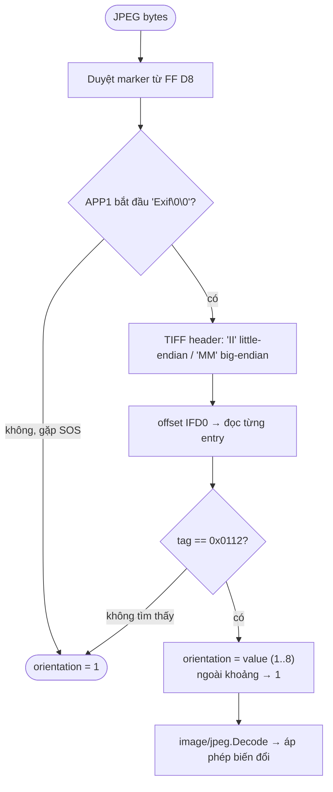
```mermaid
flowchart TD
    A([JPEG bytes]) --> B["Duyệt marker từ FF D8"]
    B --> C{"APP1 bắt đầu 'Exif\0\0'?"}
    C -->|không, gặp SOS| O1([orientation = 1])
    C -->|có| D["TIFF header: 'II' little-endian / 'MM' big-endian"]
    D --> E["offset IFD0 → đọc từng entry"]
    E --> F{"tag == 0x0112?"}
    F -->|không tìm thấy| O1
    F -->|có| G["orientation = value (1..8)<br/>ngoài khoảng → 1"]
    G --> H["image/jpeg.Decode → áp phép biến đổi"]
```

| Orientation | Phép biến đổi | Kích thước ra |
|---|---|---|
| 1 | giữ nguyên | w × h |
| 2 | lật ngang | w × h |
| 3 | xoay 180° | w × h |
| 4 | lật dọc | w × h |
| 5 | chuyển vị (lật theo đường chéo chính) | h × w |
| 6 | xoay 90° theo chiều kim đồng hồ | h × w |
| 7 | chuyển vị ngược (đường chéo phụ) | h × w |
| 8 | xoay 90° ngược chiều kim đồng hồ | h × w |

---

## 13. Nhánh PNG: tổng

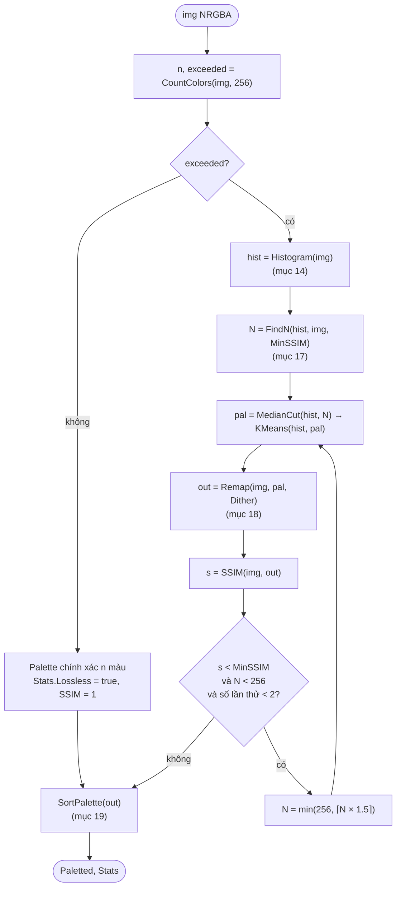
```mermaid
flowchart TD
    A([img NRGBA]) --> B["n, exceeded = CountColors(img, 256)"]
    B --> C{exceeded?}
    C -->|không| L["Palette chính xác n màu<br/>Stats.Lossless = true, SSIM = 1"] --> S
    C -->|có| H["hist = Histogram(img)<br/>(mục 14)"]
    H --> N["N = FindN(hist, img, MinSSIM)<br/>(mục 17)"]
    N --> P["pal = MedianCut(hist, N) → KMeans(hist, pal)"]
    P --> R["out = Remap(img, pal, Dither)<br/>(mục 18)"]
    R --> Q["s = SSIM(img, out)"]
    Q --> Q1{"s < MinSSIM<br/>và N < 256<br/>và số lần thử < 2?"}
    Q1 -->|có| Q2["N = min(256, ⌈N × 1.5⌉)"] --> P
    Q1 -->|không| S["SortPalette(out)<br/>(mục 19)"]
    S --> E([Paletted, Stats])
```

---

## 14. Histogram

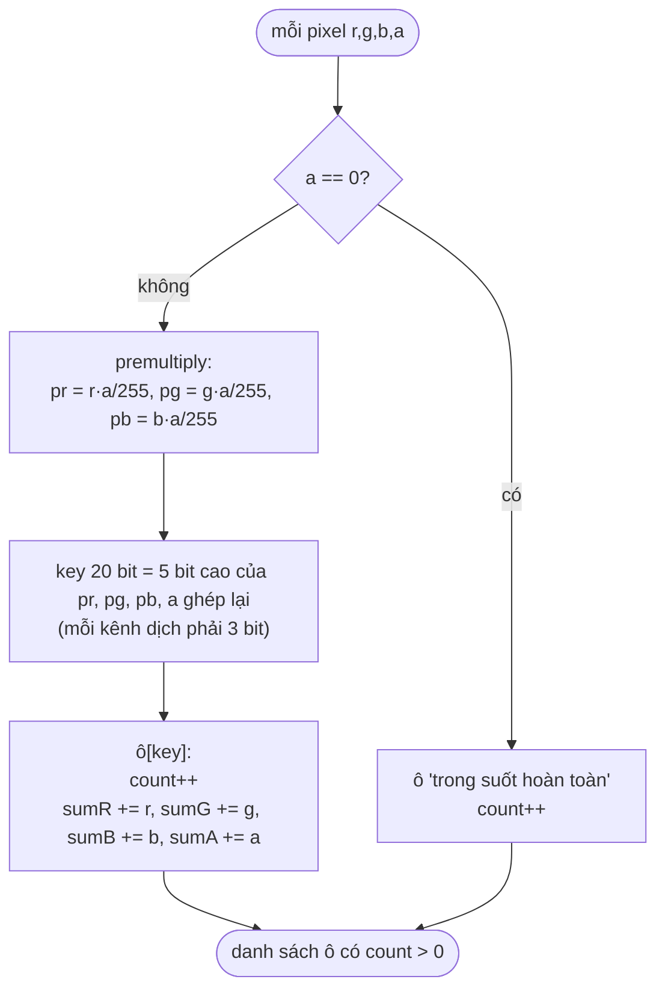
```mermaid
flowchart TD
    A([mỗi pixel r,g,b,a]) --> B{a == 0?}
    B -->|có| T["ô 'trong suốt hoàn toàn'<br/>count++"]
    B -->|không| C["premultiply:<br/>pr = r·a/255, pg = g·a/255, pb = b·a/255"]
    C --> D["key 20 bit = 5 bit cao của pr, pg, pb, a ghép lại<br/>(mỗi kênh dịch phải 3 bit)"]
    D --> E["ô[key]:<br/>count++<br/>sumR += r, sumG += g, sumB += b, sumA += a"]
    E --> F([danh sách ô có count > 0])
    T --> F
```

- Tối đa 2²⁰ ô (~1 triệu) nhưng thực tế chỉ vài nghìn ô có dữ liệu → dùng `map[uint32]*bin` hoặc mảng 1M phần tử.
- Màu đại diện của ô = `sum / count` (giá trị 8 bit gốc) → không mất độ chính xác vì 5 bit.
- Ô trong suốt hoàn toàn **không** tham gia median cut / k-means; luôn chiếm 1 mục palette `(0,0,0,0)`.

---

## 15. Median cut

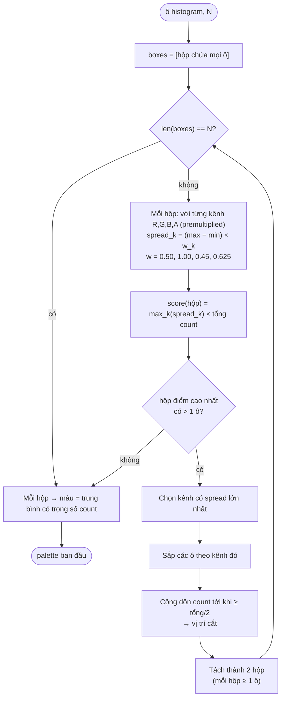
```mermaid
flowchart TD
    A([ô histogram, N]) --> B["boxes = [hộp chứa mọi ô]"]
    B --> C{"len(boxes) == N?"}
    C -->|có| Z
    C -->|không| D["Mỗi hộp: với từng kênh R,G,B,A (premultiplied)<br/>spread_k = (max − min) × w_k<br/>w = 0.50, 1.00, 0.45, 0.625"]
    D --> E["score(hộp) = max_k(spread_k) × tổng count"]
    E --> F{"hộp điểm cao nhất<br/>có > 1 ô?"}
    F -->|không| Z
    F -->|có| G["Chọn kênh có spread lớn nhất"]
    G --> H["Sắp các ô theo kênh đó"]
    H --> I["Cộng dồn count tới khi ≥ tổng/2<br/>→ vị trí cắt"]
    I --> J["Tách thành 2 hộp<br/>(mỗi hộp ≥ 1 ô)"]
    J --> C
    Z["Mỗi hộp → màu = trung bình có trọng số count"] --> R([palette ban đầu])
```

---

## 16. K-means

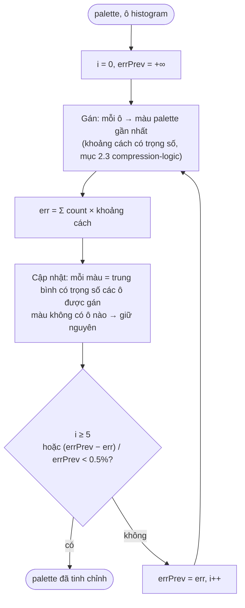
```mermaid
flowchart TD
    A([palette, ô histogram]) --> B["i = 0, errPrev = +∞"]
    B --> C["Gán: mỗi ô → màu palette gần nhất<br/>(khoảng cách có trọng số, mục 2.3 compression-logic)"]
    C --> D["err = Σ count × khoảng cách"]
    D --> E["Cập nhật: mỗi màu = trung bình có trọng số các ô được gán<br/>màu không có ô nào → giữ nguyên"]
    E --> F{"i ≥ 5<br/>hoặc (errPrev − err) / errPrev < 0.5%?"}
    F -->|có| R([palette đã tinh chỉnh])
    F -->|không| G["errPrev = err, i++"] --> C
```

Tăng tốc: tìm màu gần nhất bằng duyệt toàn bộ palette (≤ 256) — đủ nhanh vì chỉ chạy trên ô histogram, không phải pixel.

---

## 17. Tìm số màu N

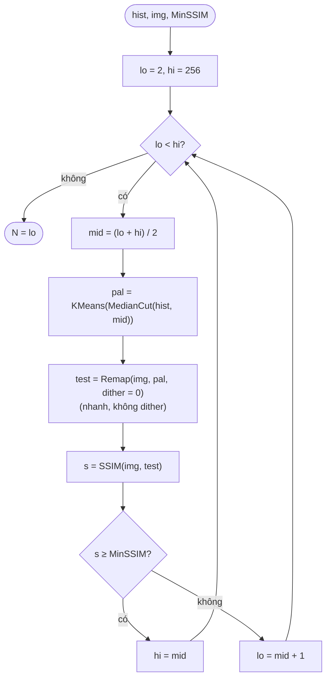
```mermaid
flowchart TD
    A([hist, img, MinSSIM]) --> B["lo = 2, hi = 256"]
    B --> C{lo < hi?}
    C -->|không| R([N = lo])
    C -->|có| D["mid = (lo + hi) / 2"]
    D --> E["pal = KMeans(MedianCut(hist, mid))"]
    E --> F["test = Remap(img, pal, dither = 0)<br/>(nhanh, không dither)"]
    F --> G["s = SSIM(img, test)"]
    G --> H{s ≥ MinSSIM?}
    H -->|có| I["hi = mid"] --> C
    H -->|không| J["lo = mid + 1"] --> C
```

- Khoảng 8 vòng (log₂ 255).
- Nếu ở N = 256 vẫn không đạt → kết quả vẫn là 256 (vòng lặp tự hội tụ về `hi = 256`).
- Tăng tốc (giai đoạn 4): đo SSIM trên ảnh thu nhỏ cạnh dài ≤ 512 px.

---

## 18. Remap + Floyd–Steinberg

```mermaid
flowchart TD
    A([img, pal, dither d]) --> B["errCur, errNext = 2 hàng sai số float (R,G,B,A)"]
    B --> Y["y = 0 .. h−1"]
    Y --> X["x = 0 .. w−1"]
    X --> P{"pixel a == 0?"}
    P -->|có| PT["index = mục trong suốt<br/>không lan sai số"] --> NX
    P -->|không| Q["c = pixel + errCur[x] (premultiplied)<br/>kẹp về [0, 255]"]
    Q --> R["k = màu gần nhất với c<br/>(cache theo khóa 5 bit)"]
    R --> S["index[x,y] = k"]
    S --> T["e = (c − pal[k]) × d"]
    T --> U["errCur[x+1]  += e × 7/16<br/>errNext[x−1] += e × 3/16<br/>errNext[x]   += e × 5/16<br/>errNext[x+1] += e × 1/16<br/>(bỏ qua ô ngoài biên hoặc pixel a=0)"]
    U --> NX["x++"]
    NX --> X
    X -->|hết hàng| SW["errCur = errNext, errNext = 0"]
    SW --> Y
    Y -->|hết ảnh| Z([Paletted])
```

Cache màu gần nhất: `map[khóa 20 bit] → index`. Ảnh có vùng phẳng lớn nên tỉ lệ trúng cache cao.

---

## 19. Sắp palette và ghi PNG

```mermaid
flowchart TD
    A([Paletted]) --> B["Chia palette:<br/>nhóm T = màu a < 255<br/>nhóm O = màu a = 255"]
    B --> C["Sắp mỗi nhóm theo luma tăng dần<br/>Y = 0.299R + 0.587G + 0.114B"]
    C --> D["palette mới = T rồi O"]
    D --> E["bảng ánh xạ cũ → mới<br/>viết lại mọi chỉ số pixel"]
    E --> F["png.Encoder{BestCompression}.Encode"]
    F --> G["Thư viện chuẩn tự:<br/>• bit depth 1/2/4/8 theo số màu<br/>• PLTE<br/>• tRNS chỉ gồm len(T) mục đầu<br/>• bộ lọc None cho ảnh palette<br/>• chỉ IHDR, PLTE, tRNS, IDAT, IEND"]
    G --> R([bytes PNG])
```

---

## 20. Nhánh JPEG

### 20.1 EncodeAuto

```mermaid
flowchart TD
    A([img, lo = 55, hi = 85, MinSSIM]) --> B{"hi − lo ≤ 2?"}
    B -->|có| Z["out = Encode(img, hi)<br/>(dùng lại nếu đã có trong cache)"] --> R([out, q = hi, ssim])
    B -->|không| C["mid = (lo + hi) / 2"]
    C --> D["o = Encode(img, mid)<br/>lưu vào cache[mid]"]
    D --> E["s = SSIM(img, Decode(o))"]
    E --> F{s ≥ MinSSIM?}
    F -->|có| G["hi = mid"] --> B
    F -->|không| H["lo = mid"] --> B
```

Khoảng 4–5 lần mã hóa. Nếu ngay cả q = 80 không đạt → vẫn trả q = 80 (giới hạn trên).

### 20.2 Encode(img, q)

```mermaid
flowchart LR
    A([img, q]) --> B["Encoder jpegli (wasm)<br/>quality = q<br/>progressive<br/>subsampling 4:2:0<br/>optimize Huffman"]
    B --> C["Đầu ra chỉ: SOI, (APP0 JFIF), DQT, SOF2, DHT, SOS…, EOI<br/>không APP1..APP15"]
    C --> R([bytes])
    B -.->|"jpegli không dùng được<br/>(nợ kỹ thuật)"| F["image/jpeg chuẩn<br/>baseline, 4:2:0"]
    F --> R
```

---

## 21. Ước lượng chất lượng JPEG gốc

```mermaid
flowchart TD
    A([bytes JPEG gốc]) --> B["Tìm marker DQT (FF DB)"]
    B -->|không có| NO([ok = false])
    B --> C["Lấy bảng id 0 (luma), 64 hệ số, thứ tự zigzag"]
    C --> D["Đổi bảng chuẩn IJG (luma) sang thứ tự zigzag"]
    D --> E["s = trung bình (Q_i × 100 / STD_i)"]
    E --> F{s ≤ 100?}
    F -->|có| G["q = (200 − s) / 2"]
    F -->|không| H["q = 5000 / s"]
    G & H --> R(["q làm tròn, kẹp [1, 100], ok = true"])
```

Dùng để không mã hóa lại một JPEG vốn đã nén mạnh hơn mức q tìm được (mục 10, nhánh J3).

---

## 22. SSIM

```mermaid
flowchart TD
    A([ảnh a, ảnh b cùng kích thước]) --> B{"có pixel a < 255<br/>ở một trong hai ảnh?"}
    B -->|không| C["s = ssimLuma(a, b)"] --> R([s])
    B -->|có| D["sW = ssimLuma(trên nền trắng)<br/>sK = ssimLuma(trên nền đen)"]
    D --> E["s = min(sW, sK)"] --> R

    subgraph LUMA["ssimLuma(x, y)"]
        L1["Y = 0.299R + 0.587G + 0.114B (float64)"] --> L2{"w < 8 hoặc h < 8?"}
        L2 -->|có| L3["một cửa sổ = toàn ảnh"]
        L2 -->|không| L4["cửa sổ 8×8, bước 4 px"]
        L3 & L4 --> L5["mỗi cửa sổ: μx, μy, σx², σy², σxy"]
        L5 --> L6["SSIM_w = ((2μxμy + C1)(2σxy + C2)) /<br/>((μx² + μy² + C1)(σx² + σy² + C2))<br/>C1 = (0.01·255)², C2 = (0.03·255)²"]
        L6 --> L7["trung bình mọi cửa sổ"]
    end
```

PSNR: `10·log10(255² / MSE)` trên RGB đã trộn nền trắng; MSE = 0 → `+Inf`.

---

## 23. Cấu trúc dữ liệu

```mermaid
classDiagram
    class Options {
        bool Lossless
        float64 MinSSIM = 0.98
        float64 Dither = 1.0
        int Quality = 0 nghĩa là auto
        bool WhiteBG
        Limits Limits
    }
    class Limits {
        int64 MaxBytes = 0 (không giới hạn)
        int64 MaxPixels = 100 MP
    }
    class Report {
        string Input
        string Output
        Format FormatIn
        Format FormatOut
        int SizeIn
        int SizeOut
        float64 SavedPct
        int Width
        int Height
        int Colors
        int Quality
        float64 SSIM
        float64 PSNR
        string Skipped
        []string Warnings
    }
    class QuantOptions {
        int MaxColors = 256
        float64 MinSSIM
        float64 Dither
    }
    class QuantStats {
        int Colors
        float64 SSIM
        bool Lossless
    }
    class Item {
        string Path
        int64 Size
        FileMode Mode
        Time ModTime
    }
    class ScanOptions {
        bool Recursive = true
        []string Include = png,jpg,jpeg
        []string Exclude
        bool Force
    }
    class ScanResult {
        []Item Items
        int Marked
        []string StaleTemps
        int64 TotalBytes
    }
    class Result {
        Item Item
        Report Report
        error Err
        Duration Duration
    }

    Options *-- Limits
    ScanResult *-- Item
    Result *-- Item
    Result *-- Report
    Options ..> QuantOptions : Compress tạo ra
    QuantOptions ..> QuantStats : Quantize trả về
```

---

## 24. Lỗi và mã thoát

```mermaid
flowchart LR
    subgraph PerFile["Lỗi từng file → Result.Err (không dừng file khác)"]
        E1[ErrUnsupportedFormat]
        E2[ErrTooLarge]
        E3[ErrCorrupt]
        E4["lỗi đọc / ghi / rename"]
    end
    subgraph Skip["Bỏ qua — không tính là lỗi"]
        S1["already_optimal"]
        S2["already_marked"]
        S3["animated (ErrAnimated)"]
        S4["canceled (Ctrl+C lần 2)"]
    end
    subgraph Global["Lỗi toàn cục"]
        G1["flag sai"]
        G2["path không tồn tại"]
        G3["ErrNeedYes / người dùng trả lời không"]
    end
    subgraph Warn["Cảnh báo — chỉ in"]
        W1["ErrMarkUnsupported (in 1 lần)"]
        W2["icc_profile_dropped"]
        W3["LowerPriority thất bại"]
    end

    PerFile --> X1(["exit 1 nếu có ≥ 1 lỗi"])
    Skip --> X0(["exit 0"])
    Warn --> X0
    Global --> X2(["exit 2"])
```
